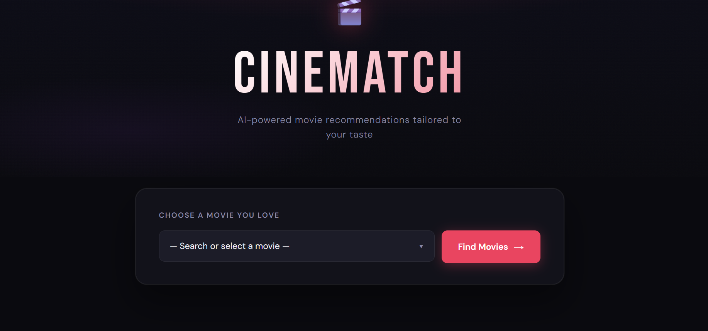

# 🎬 CineMatch – AI Movie Recommendation System

CineMatch is a content-based movie recommendation web app that suggests similar movies based on user selection using machine learning and cosine similarity.

---

## 🚀 Live Demo
(Add deployed link here later)

---

## 📌 Features
- 🎯 AI-based movie recommendations
- 🎬 TMDB poster integration
- ⚡ Fast Flask backend
- 🎨 Modern Netflix-inspired UI
- 🔍 Real-time user interaction

---

## 🧠 How It Works
- Movies are processed using NLP techniques (tags, genres, cast)
- Cosine similarity is computed between movies
- Top 5 similar movies are recommended

---

## 🛠️ Tech Stack
- Python
- Flask
- Pandas, NumPy
- Scikit-learn
- TMDB API
- HTML, CSS, JavaScript

---

## 📂 Dataset
- TMDB 5000 Movie Dataset

---

### 🎬 UI Preview
## 📸 Screenshots

### Home Page


### Results Page


## ⚙️ Installation

```bash
git clone https://github.com/your-username/CineMatch.git
cd CineMatch
pip install -r requirements.txt
python app.py
